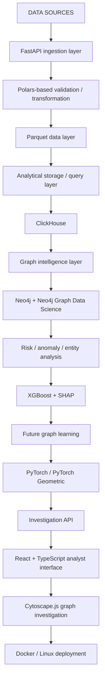

# NIRIKSHAK

### Bitcoin Transaction Intelligence & Investigative Analysis Platform

NIRIKSHAK is designed to analyze Bitcoin transaction and network metadata, connect blockchain entities with network observations, surface anomalous behavior, and provide explainable investigative leads through an analyst-focused interface.

## 1. Project Overview

NIRIKSHAK empowers analysts to conduct rigorous, data-driven investigations on cryptocurrency transactions. It transforms raw blockchain and network intelligence into structured investigative narratives.

## 2. Problem Statement

Tracing illicit activities in complex cryptocurrency networks is incredibly difficult without automated intelligence and clear evidence. Existing tools often lack the capability to fuse on-chain transaction data with off-chain network observations efficiently and explainably.

## 3. Why NIRIKSHAK

NIRIKSHAK provides deterministic intelligence by merging bounded local graph analytics, explainable risk evidence, and structured investigative workflows into a single cohesive platform.

## 4. Core Capabilities

- **Dataset Ingestion:** Robust ingestion and normalization of transaction datasets.
- **Transaction Analysis:** Deep inspection of UTXO transaction flows.
- **Wallet Investigation:** Comprehensive profiles for individual wallets, including connected paths and risk signals.
- **Investigation Activity:** Feed of investigative actions and updates on monitored entities.
- **Graph-Based Investigation Interface:** Interactive 3D Force Graph for exploring local entity neighborhoods.
- **Transaction and Alert Views:** Detailed tabular views of alerts and transactions.
- **Dataset Import:** Support for loading benchmark datasets directly via UI.
- **Dashboard Intelligence Views:** High-level metrics and platform telemetry.
- **Path Investigation:** Multi-hop causal progression from Target Wallet through UTXO transfers and network metadata.
- **Reproducible Demo Data:** Deterministic baseline data to demonstrate the platform capabilities offline.

## 5. Final System Architecture

**Final Target Architecture**



*(Note: Distinguish this from the Current Demonstration / Prototype, which utilizes a subset of these technologies for baseline demonstration).*

## 6. Technology Stack

### Current Implementation

- **React**
- **TypeScript**
- **Vite**
- **FastAPI**
- **Python**
- **Polars**
- **Parquet**
- **Docker**
- **Linux**

### Final Target Stack

**Frontend:**
- React
- TypeScript
- Cytoscape.js

**Backend:**
- FastAPI
- Python
- Polars

**Data:**
- Parquet
- ClickHouse

**Graph:**
- Neo4j
- Neo4j Graph Data Science

**ML / Explainability:**
- XGBoost
- SHAP

**Future graph learning:**
- PyTorch
- PyTorch Geometric

**Infrastructure:**
- Docker
- Linux

## 7. Investigation Workflow

1. **Import dataset:** Load transaction and network data into the system.
2. **Validate and normalize records:** Clean and structure the raw intelligence.
3. **Generate/query transaction intelligence:** Extract features and metrics from the data.
4. **Build entity relationships:** Map connections between wallets, IPs, and ASNs.
5. **Identify suspicious patterns:** Highlight anomalies based on activity and velocity.
6. **Investigate wallets / transactions:** Deep-dive into specific entities using the analyst interface.
7. **Explore relationship paths:** Trace funds and network metadata across multiple hops.
8. **Inspect supporting evidence:** Review the specific indicators that flagged an entity.
9. **Generate ranked investigative leads:** Produce actionable intelligence reports.

## 8. Data Model

- **Transaction:** A record of value transfer between addresses.
- **Wallet / Address:** An entity identifier on the blockchain.
- **Network observation:** Metadata such as broadcasting IPs and ASNs.
- **IP / Port metadata:** Network-layer details associated with transaction broadcasts.
- **Entity:** A clustered or individual actor in the network.
- **Relationship:** Edges connecting wallets (transactions) or wallets to network artifacts.
- **Investigation:** A tracked session focused on a target entity.
- **Risk signal:** A specific indicator of suspicious behavior.
- **Evidence:** Data points supporting a risk signal.
- **Investigative lead:** A high-priority entity flagged for further review.

## 9. Frontend Intelligence Interface

The React + TypeScript frontend is designed exclusively for analytical workflows, providing dense information displays, 3D graph visualizations, and intuitive navigation across entities and transactions.

## 10. Current Prototype Status

| Layer | Current State |
|------|---------------|
| Frontend | Working |
| Backend API | Working |
| Dataset workflow | Working |
| Dashboard | Working |
| Wallet investigation | Working |
| Graph investigation UI | Working |
| Neo4j | Planned final architecture |
| ClickHouse | Planned final architecture |
| XGBoost + SHAP | Planned final architecture |
| PyTorch / PyG | Future extension |

## 11. Final Architecture Roadmap

**PHASE 1 — Clean prototype baseline**
- Current repository baseline
- Stable frontend/backend
- Dataset workflow
- Investigation interface

**PHASE 2 — Graph intelligence**
- Neo4j
- Neo4j GDS
- Cytoscape.js
- Relationship-centric investigation

**PHASE 3 — Analytical scale**
- ClickHouse
- larger analytical workloads
- optimized transaction/network querying

**PHASE 4 — Explainable intelligence**
- XGBoost
- SHAP
- richer risk/anomaly modeling

**PHASE 5 — Advanced graph learning**
- PyTorch
- PyTorch Geometric
- graph representation learning / advanced entity intelligence

## 12. Repository Structure

```text
Nirikshak-/
├── README.md
├── .gitignore
├── .dockerignore
├── docker-compose.yml
├── run_demo.sh
├── docs/
├── backend/
│   ├── Dockerfile
│   ├── requirements.txt
│   ├── app/
│   ├── scripts/
│   │   ├── datasets/
│   │   └── verification/
│   ├── tests/
│   ├── data/
│   └── models/
└── frontend/
    ├── Dockerfile
    ├── nginx.conf
    ├── package.json
    ├── package-lock.json
    ├── public/
    │   ├── branding/
    │   └── team/
    └── src/
        ├── components/
        │   ├── dashboard/
        │   ├── graph/
        │   ├── investigation/
        │   └── ui/
        ├── demo/
        ├── hooks/
        ├── lib/
        └── pages/
```
*(Note: Licensing is currently pending).*

## 13. Running Locally

**Local development:**
Start the backend API and frontend dev server:
```bash
./run_demo.sh
```
Or run them individually via `npm run dev` in `frontend` and standard Uvicorn in `backend`.

**Docker:**
Build and run the full stack:
```bash
docker-compose up --build
```

## 14. Docker Setup

The repository includes `Dockerfile`s for both frontend and backend, orchestrated via `docker-compose.yml`.

## 15. Development

Ensure Node.js and Python are installed. Refer to `docs/DEVELOPMENT.md` for extended guidelines.

## 16. Team

Developed by **Team Tarang** for SIH26146.

## 17. SIH Context

This project is developed for the Smart India Hackathon 2026, addressing the challenge of cryptocurrency transaction tracking and investigative intelligence.

## 18. License

Licensing details are pending.
